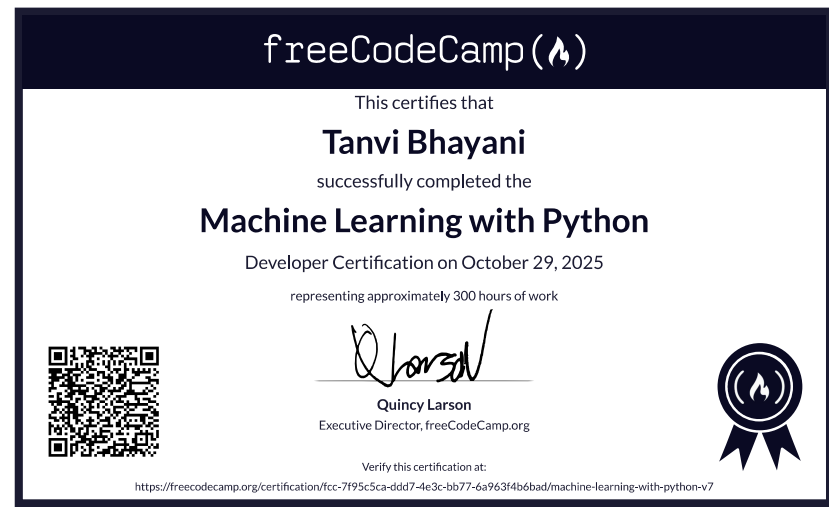
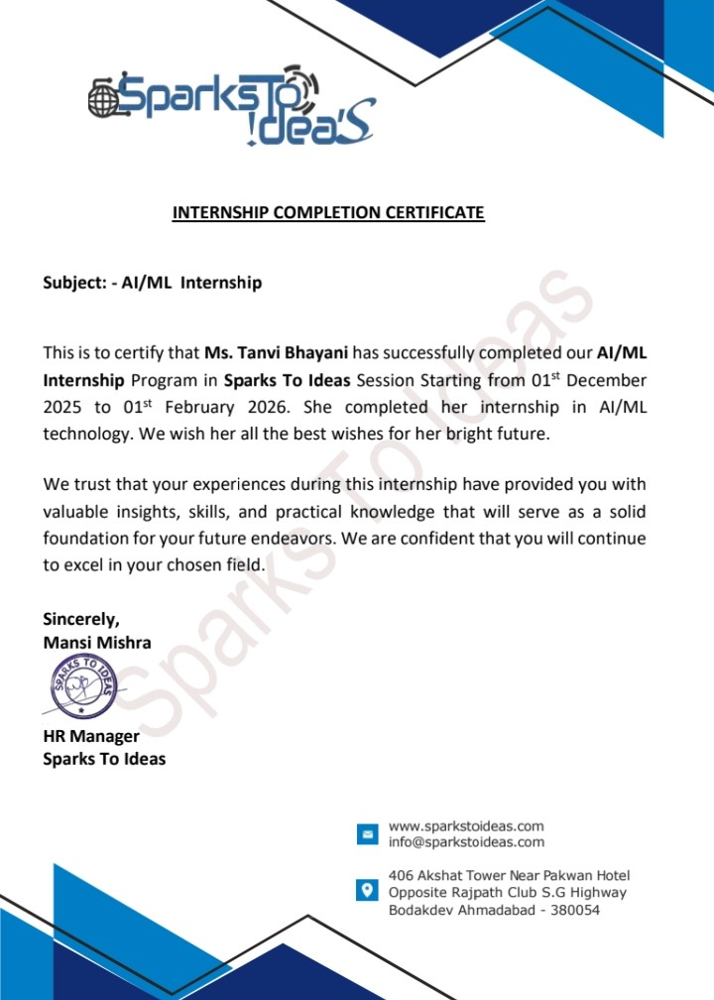

AI & Machine Learning Certifications Portfolio

⭐ Actively Learning | Data Science Enthusiast | AI Explorer

Welcome to my certification portfolio showcasing my journey in Artificial Intelligence, Machine Learning, and Data Science.

📜 1️⃣ Machine Learning Certification
📘 About the Certification

Successfully completed a comprehensive Machine Learning course, covering:

Data Preprocessing & Feature Engineering

Supervised Learning (Regression & Classification)

Unsupervised Learning (Clustering)

Model Training & Evaluation

Real-World ML Applications

🛠 Skills Gained

Python for Machine Learning

NumPy & Pandas for Data Manipulation

Scikit-learn for Model Building

Model Evaluation Techniques

🎯 Objective

To build intelligent systems that can learn from data and make accurate predictions.

🖼 Certificate Preview

  

📄 View Full Certificate

🔗 Click Here to View Machine Learning Certificate

🤖 2️⃣ AI & Machine Learning Internship Completion Certificate
🏢 Organization

Sparks To Ideas – Data Science & AI Internship

📘 Internship Highlights

Worked on real-world datasets

Performed Data Cleaning & Exploratory Data Analysis (EDA)

Built and evaluated Machine Learning models

Created dashboards & visualizations using Python & Power BI

Applied ML algorithms for predictive analytics

🛠 Tools & Technologies Used

Python

Pandas & NumPy

Scikit-learn

Power BI

Excel

🎯 Outcome

Successfully completed the internship with practical experience in end-to-end AI & Machine Learning workflows.

🖼 Internship Certificate Preview

  

📄 View Full Internship Certificate

🔗 Click Here to View AI & ML Internship Certificate

🚀 Career Focus

I am passionate about Data Science, Machine Learning, and AI-driven solutions, and continuously building real-world projects to strengthen my technical expertise and problem-solving abilities.
