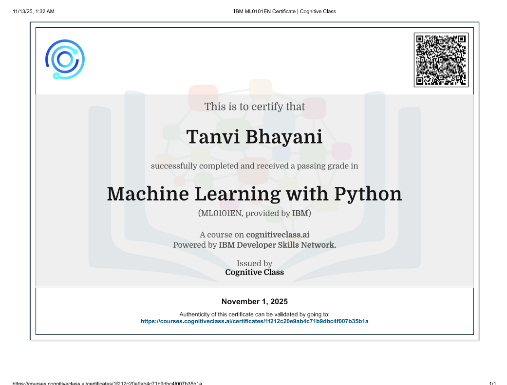

🧠 AI & Machine Learning Certifications Portfolio

⭐ Actively Learning | Data Science Enthusiast | AI Explorer

Welcome to my certification portfolio showcasing my journey in Artificial Intelligence, Machine Learning, and Data Science.

📜 1️⃣ Machine Learning Certification
📘 About the Certification

Successfully completed a comprehensive Machine Learning course, covering:

Data Preprocessing & Feature Engineering

Supervised Learning (Regression & Classification)

Unsupervised Learning (Clustering)

Model Training & Evaluation

Real-World ML Applications

🛠 Skills Gained

Python for Machine Learning

NumPy & Pandas for Data Manipulation

Scikit-learn for Model Building

Model Evaluation Techniques

🖼 Certificate Preview

  

📄 View Certificate

🔗 Machine Learning Certificate

🎓 2️⃣ FreeCodeCamp – Machine Learning with Python
📘 Highlights

Completed Machine Learning with Python certification

Worked on practical ML projects

Learned model training, evaluation & deployment basics

📄 View Certificate

🔗 FreeCodeCamp ML Certificate

🏆 3️⃣ IBM – Machine Learning with Python
📘 Highlights

Gained foundational knowledge of ML concepts

Implemented supervised & unsupervised algorithms

Hands-on practice using Python & Scikit-learn

📄 View Certificate

🔗 IBM Machine Learning Certificate

🤖 4️⃣ AI & Machine Learning Internship Completion Certificate
🏢 Organization

Sparks To Ideas – Data Science & AI Internship

📘 Internship Highlights

Worked on real-world datasets

Performed Data Cleaning & Exploratory Data Analysis (EDA)

Built and evaluated Machine Learning models

Created dashboards & visualizations using Python & Power BI

Applied ML algorithms for predictive analytics

🖼 Internship Certificate Preview

  

📄 View Internship Certificate

🔗 Sparks To Ideas Internship Certificate

🚀 Career Focus

I am passionate about Data Science, Machine Learning, and AI-driven solutions, and continuously building real-world projects to strengthen my technical expertise and problem-solving abilities.
